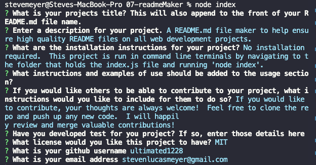
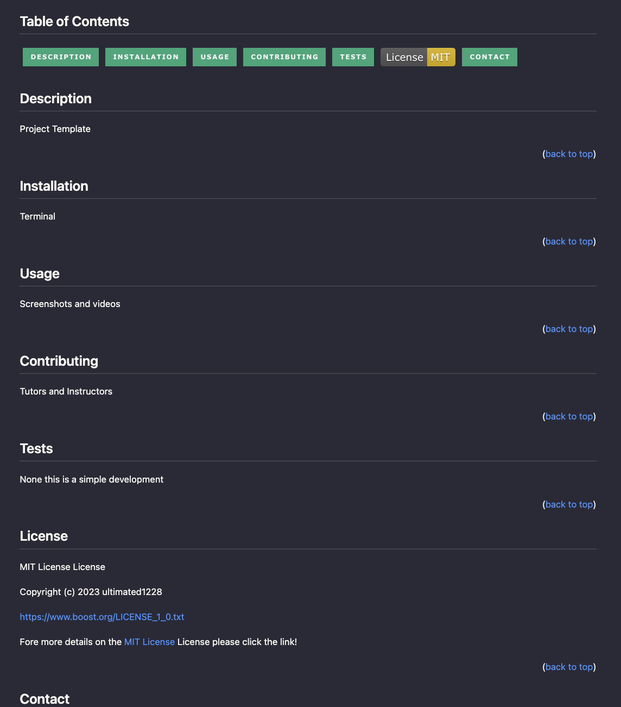

# Readme Maker

  ## Table of Contents

  

  
  
  
  
  
  
  

## Description
A README.md file maker to help ensure high quality README files on all web development projects.  This was an assignment from the UC-Irvine full stack coding bootcamp.  The following criteria were given:

### User Story
AS A developer 
I WANT a README generator 
SO THAT I can quickly create a professional README for a new project

### Acceptance Criteria
GIVEN a command-line application that accepts user input  
WHEN I am prompted for information about my application repository  
THEN a high-quality, professional README.md is generated with the title of my project and sections entitled Description, Table of Contents, Installation, Usage, License, Contributing, Tests, and Questions  
WHEN I enter my project title  
THEN this is displayed as the title of the README  
WHEN I enter a description, installation instructions, usage information, contribution guidelines, and test instructions  
THEN this information is added to the sections of the README entitled Description, Installation, Usage, Contributing, and Tests  
WHEN I choose a license for my application from a list of options  
THEN a badge for that license is added near the top of the README and a notice is added to the section of the README entitled License that explains which license the application is covered under  
WHEN I enter my GitHub username  
THEN this is added to the section of the README entitled Questions, with a link to my GitHub profile  
WHEN I enter my email address  
THEN this is added to the section of the README entitled Questions, with instructions on how to reach me with additional questions  
WHEN I click on the links in the Table of Contents  
THEN I am taken to the corresponding section of the README  

(<a href="#Readme Maker">back to top</a>)

## Installation
No installation required.  This project is run in command line terminals by navigating to the folder that holds the index.js file and running 'node index'.  

(<a href="#Readme Maker">back to top</a>)

## Usage
A screenshot of the command line filled out:  
  

A screenshot of the completed README.md:
  

A gif of the application being run:
  

[Link to .mov file with audio](https://drive.google.com/file/d/1zi1hL9ZSp4gd5TTVOiNU5rNFYx5un610/view?usp=sharing)

(<a href="#Readme Maker">back to top</a>)

## Contributing

If you would like to contribute, your thoughts are always welcome!  Feel free to clone the repo and push up any new code.  I will happily review and merge valuable contributions!

(<a href="#Readme Maker">back to top</a>)

## Tests

This is a fairly simple file program, and no tests have been developed

(<a href="#Readme Maker">back to top</a>)

## License
MIT Software License - Version 1.0 - August 17th, 2003

Permission is hereby granted, free of charge, to any person or organization
obtaining a copy of the software and accompanying documentation covered by
this license (the "Software") to use, reproduce, display, distribute,
execute, and transmit the Software, and to prepare derivative works of the
Software, and to permit third-parties to whom the Software is furnished to
do so, all subject to the following:

The copyright notices in the Software and this entire statement, including
the above license grant, this restriction and the following disclaimer,
must be included in all copies of the Software, in whole or in part, and
all derivative works of the Software, unless such copies or derivative
works are solely in the form of machine-executable object code generated by
a source language processor.

THE SOFTWARE IS PROVIDED "AS IS", WITHOUT WARRANTY OF ANY KIND, EXPRESS OR
IMPLIED, INCLUDING BUT NOT LIMITED TO THE WARRANTIES OF MERCHANTABILITY,
FITNESS FOR A PARTICULAR PURPOSE, TITLE AND NON-INFRINGEMENT. IN NO EVENT
SHALL THE COPYRIGHT HOLDERS OR ANYONE DISTRIBUTING THE SOFTWARE BE LIABLE
FOR ANY DAMAGES OR OTHER LIABILITY, WHETHER IN CONTRACT, TORT OR OTHERWISE,
ARISING FROM, OUT OF OR IN CONNECTION WITH THE SOFTWARE OR THE USE OR OTHER
DEALINGS IN THE SOFTWARE.

Fore more details on the [MIT License](https://opensource.org/licenses/MIT) License please click the link!

(<a href="#Readme Maker">back to top</a>)

## Contact
You can get in touch with the creator through:

[My Github](https://github.com/ultimated1228)

[Email the creator](mailto:stevenlucasmeyer@gmail.com)

(<a href="#Readme Maker">back to top</a>)
